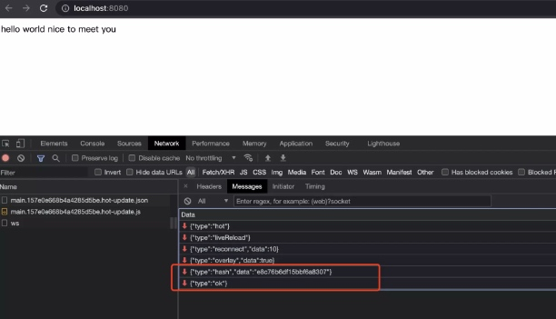

# 热更新原理分享
## 前言
* 一种是页面刷新，不保留页面状态，直接window.location.reload()。
* 另一种是基于`WDS (Webpack-dev-server)`的模块热替换，只需要局部刷新页面上发生变化的模块，同时可以保留当前的页面状态。

## 如何使用
### 1. webpack配置
> 主要开启 devServer 配置项和添加 hotModuleReplacementPlugin 插件

```
const path = require('path')
const webpack = require('webpack')
module.exports = {
	entry: './index.js',
	output: {
		filename: 'bundle.js',
		path: path.join(__dirname, '/')
	},
	devServer: {
		hot: true
	}
    plugins: [
      // 可以通过添加 --hot 配置项代替插件
      new webpack.hotModuleReplacementPlugin()  
    ]
}
```
### 2. 业务代码
```
....
impor hello from 'hello.js';
if (module.hot) {
  module.hot.accept('./xx.js', function () {
    hello(）
  })
}
```
### 3. React
[react-refresh-webpack-plugin](https://github.com/pmmmwh/react-refresh-webpack-plugin/tree/main/examples/webpack-dev-server)

## 疑问
1. 通过 webpack HMR 进行开发的过程中，我并没有在我的 dist 目录中找到 webpack 打包好的文件，它们去哪呢？
2. 当模块的热替换过程中，如果替换模块失败，有什么回退机制吗？
3. 为什么业务代码中要配置module.hot.accept，它起了什么作用

## 前置知识
### 1.module、chunk、bundle
* `module`: 我们写的每个 js文件，也就是模块的概念，所有的资源都有可能是module，包括js、css、图片等
* `chunk`: webpack打包过程中被分割的组，webpack根据module的依赖关系和配置文件，生成一个个chunk，它包括若干个module
* `bundle`: webpack打包出的文件，一般而言，一个chunk对应一个bundle，如果配置了sourceMap，一个chunk就会对应多个bundle


#### Q：如何产生chunk
* entry: 写在入口文件处 (entry point) 的各种文件，就是 chunk 
* 异步：require.ensure('./xx.js')或 import('./xx.js')会生成 async chunk
* 代码分割：splitChunkPlugin 分包优化

### 2.webpack-dev-middleware
> 它是webpack-dev-server的一个中间件，主要工作是编译，主要干了三件事

* 通过watch mode，监听资源的变更，然后自动打包
* 设置文件系统为内存文件系统，既让webpack的编译输出到内存中，而不是写入磁盘
* 实现了 express 中间件，将编译的文件返回

#### Q: 为什么要设计这个中间件
各司其职，编译文件相关的操作都抽离到 webpack-dev-middleware 这个中间件里，webpack-dev-server只负责是创建server服务器和websoket服务器

### 3.HotModuleReplacementPlugin
> 模块热更新插件，主要作用有两个

1. 在构建出来的 bundle.js 文件中注入 HMR runtime 运行时代码
* 配置热更新前


* 配置热更新后


2. 发送请求

* manifest.json：发送编译生成的hash.hot-update.json 请求，获取热更新模块和标识
* updated chunk:  发送chunk名字.编译生成的hash.hot-update.js  请求，把更新的模块赋值给全局全量 hotUpdate


#### Q: hash值的作用？
* 客户端的websocket监听到文件改动推送来的hash戳，会和上一次对比：一致则走缓存；不一致则通过 ajax 和 jsonp 请求向服务端获取最新资源

## 热更新过程
### 第一步：webpack-dev-server本地启动 express 服务
> express服务主要做了三件事

* 启动 webpack 生成 compiler 实例。compiler贯穿 webpack 的整个生命周期，compiler 上有很多方法，比如可以启动 webpack 所有编译工作，以及监听本地文件的变化及监听编译的完成
* 创建本地服务器，让浏览器可以请求本地的静态资源。
* 启动 websocket 服务。通过 websocket，可以建立本地服务和浏览器的双向通信。这样就可以实现当本地文件发生变化，立马告知浏览器可以热更新代码了

#### 源码：
* 入口：node_modules/webpack-dev-server/bin/webpack-dev-server.js
> 作用：启动 webpack 生成 compiler 实例

```
// 创建 webpack 实例
let compiler = webpack(config);

// 创建 Server 类，这个类里包括 webpack-dev-server 服务端主要逻辑
let server = new Server(compiler, options, log);

// 启动 webserver 服务
server.listen(options.port, options.host, (err) => {
    if (err) {throw err};
});
```

* Server类：node_modules/webpack-dev-server/lib/Server.js

> 作用：使用 express 框架启动本地 server；启动 websocket 服务

```
class Server {
    constructor() {
        this.setupApp();
        // 创建 Server 服务器
        this.createServer();
    }
   
    setupApp() {
        // 依赖了express
    	this.app = new express();
    }
    
    createServer() {
        this.listeningApp = http.createServer(this.app);
    }

    listen(port, hostname, fn) {
        return this.listeningApp.listen(port, hostname, (err) => {
            // 启动 express 服务后，启动 websocket 服务
            // websocket 服务主要通过 sockjs 实现
            this.createSocketServer();
        }
    }                                   
}
```

### 第二步：devServer监听文件变化

> 通过 setupDevMiddleware 方法实现的，这个方法主要执行了 webpack-dev-middleware中间件

源码：

入口：node_modules/webpack-dev-server/lib/Server.js

```
  setupDevMiddleware() {
    const webpackDevMiddleware = require("webpack-dev-middleware");

    // middleware for serving webpack bundle
    this.middleware = webpackDevMiddleware(
      this.compiler,
      this.options.devMiddleware
    );
  }
```
webpackDevMiddleware方法：node_modules/webpack-dev-middleware/dist/index.js 

```
// 监控文件的变化，每当有文件改变的时候都会重新编译打包
compiler.watch(options.watchOptions, (err) => { if (err) { /*错误处理*/ } }); 

// 通过“memfs”库将打包后的文件写入内存
setupOutputFileSystem(context);

```

#### Q: 通过 webpack HMR 进行开发的过程中，我并没有在我的 dist 目录中找到 webpack 打包好的文件，它们去哪呢？
* 通过 memfs 库将打包后的文件写入内存。优势在于访问内存中的代码比访问文件系统中的文件更快，而且也减少了代码写入文件的开销 

### 第三步：devServer 通知浏览器端文件发生改变
> 通过往 compiler.hooks.done（webpack 编译完成后触发） 钩子上注册事件实现，每当新的编译产生后都会向客户端发送 hash 和 ok 消息

源码：
入口：node_modules/webpack-dev-server/lib/Server.js
```
setupHooks() {
    this.compiler.hooks.done.tap(
      "webpack-dev-server",
      /**
       * @param {Stats | MultiStats} stats
       */
      (stats) => {
        // 每次编译都会产生一个唯一的hash值
        this.currentHash = stats.hash;
        
        // 每当新一个编译完成后都会向所有的websocket客户端发送消息
        for (const client of this.webSocketServer.clients) {
          // 先向客户端发送最新的hash值
          client.send({type: 'hash', data: this.currentHash});
          // 再向客户端发送一个ok
          client.send({type: 'ok'})
        }
      }
    );
  }
```

### 第四步：浏览器收到热更新的通知
> 浏览器先接收到 type 为 hash 消息，暂存 hash 值，然后接收到 type 为 ok 的消息，执行reloadApp 方法



源码：

node_modules/webpack-dev-server/client/index.js
* 作用：reloadApp方法中，会根据 hot 配置决定是刷新浏览器还是对代码进行热更新

```
// 接收到 type 为 hash 消息后会将 hash 值暂存起来
hash: function msgHash(hash) {
    currentHash = hash;
},

// 接收到 type 为 ok 的消息后对应用执行 reload 操作
ok: function msgOk() {
    reloadApp();
},

function reloadApp() {
  if (hot) {
    log.info('[WDS] App hot update...');
    const hotEmitter = require('webpack/hot/emitter');
    // 触发 webpackHotUpdate 方法
    hotEmitter.emit('webpackHotUpdate', currentHash);

  } else {
    log.info('[WDS] App updated. Reloading...');
    self.location.reload();
  }
}
```

### 第五步：webpackHotUpdate接收到最新的 hash 值，并进行检查更新
> 检查更新调用的是 module.hot.check 方法 

源码：

node_modules/webpack/hot/dev-server.js 
```
var hotEmitter = require("./emitter");
hotEmitter.on("webpackHotUpdate", function (currentHash) {
  lastHash = currentHash;
  check();
});
var check = function check() {
    module.hot
      .check(true)
      .then(function (updatedModules) {
        // 容错，直接刷新页面
        if (!updatedModules) {
          window.location.reload();
          return;
        }
        
        // 热更新结束，打印信息
        if (upToDate()) {
          log("info", "[HMR] App is up to date.");
        }
      })
      .catch(function (err) {
         window.location.reload();
      });
  };
```

#### Q2: 当模块的热替换过程中，如果替换模块失败，有什么回退机制吗？
* 如果在热更新过程中出现错误，热更新将回退到刷新浏览器

### 第六步：module.hot.check方法 检查更新
> module.hot.check 里主要执行两个方法

* hotDownloadManifest 方法：发送编译生成的hash.hot-update.json 的 ajax 请求 
* hotDownloadUpdateChunk 方法：通过 JSONP 的方式，发送chunk名字.编译生成的hash.hot-update.js 请求 


源码：
```
// 调用 hotCheck 拉取两个补丁文件
var hotCheck = () => {
  hotDownloadManifest().then(hotUpdate => {
    hotDownloadUpdateChunk(chunkID);
  })
}

var hotDownloadManifest = () => {
  fetch(`${chunkName}.${hash}.hot-update.json`).then((response) => {
    return response.json();
  })
}

var hotDownloadUpdateChunk = () => {
  var script = document.createElement('script');
  script.charset = 'utf-8';
  script.src = `${chunkName}.${hash}.hot-update.js`;
  document.head.appendChild(script);
}
```

### 第七步：hotApply 热更新模块替换
> 主要有三步
1. 删除过期的模块，就是需要替换的模块

```
var queue = outdatedModules.slice();
while (queue.length > 0) {
    moduleId = queue.pop();
    // 从缓存中删除过期的模块
    module = installedModules[moduleId];
    // 删除过期的依赖
    delete outdatedDependencies[moduleId];
    
    // 存储了被删掉的模块id，便于更新代码
    outdatedSelfAcceptedModules.push({
        module: moduleId
    });
}
```

2. 将新的模块添加到 modules 中

```
appliedUpdate[moduleId] = hotUpdate[moduleId];
for (moduleId in appliedUpdate) {
    if (Object.prototype.hasOwnProperty.call(appliedUpdate, moduleId)) {
        modules[moduleId] = appliedUpdate[moduleId];
    }
}
```

3. 通过__webpack_require__（webpack重写reqiure方法）执行相关模块的代码
```
for (i = 0; i < outdatedSelfAcceptedModules.length; i++) {
    var item = outdatedSelfAcceptedModules[i];
    moduleId = item.module;
    try {
        // 执行最新的代码
        __webpack_require__(moduleId);
    } catch (err) {
        // ...容错处理
    }
}
```

### 第八步：业务代码调用module.hot.accept方法

#### Q5：为什么业务代码中要配置module.hot.accept，它起了什么作用
* 当用新的模块代码替换老的模块后，但是我们的业务代码并不能知道代码已经发生变化，也就是说，当模块修改后，我们需要在 index.js 文件中调用 HMR 的 accept 方法，添加模块更新后的处理函数，及时将模块的返回值插入到页面中。代码如下：

```
// index.js
if(module.hot) {
	module.hot.accept('./hello.js', function() {
		hello()
	})
}
```

## 总结
热更新流程可以总结为以下步骤：
1. webpack-dev-server 本地启动 express 服务
2. 服务端和客户端建立 websocket 连接
3. webpack监听源码的变化，当源码发生改变时会触发websocket的重新编译
    * 每次编译会生产该次编译的hash值、本地改动模块的json、js文件
    * 编译完成后通过socket向客户端推送当前编译的hash戳
4. 客户端的websocket监听到文件改动推送来的hash戳，会和上一次对比：
一致则走缓存
    * 不一致则通过ajax和jsonp向服务端获取最新资源
    * 客户端执行变更逻辑


    
    


